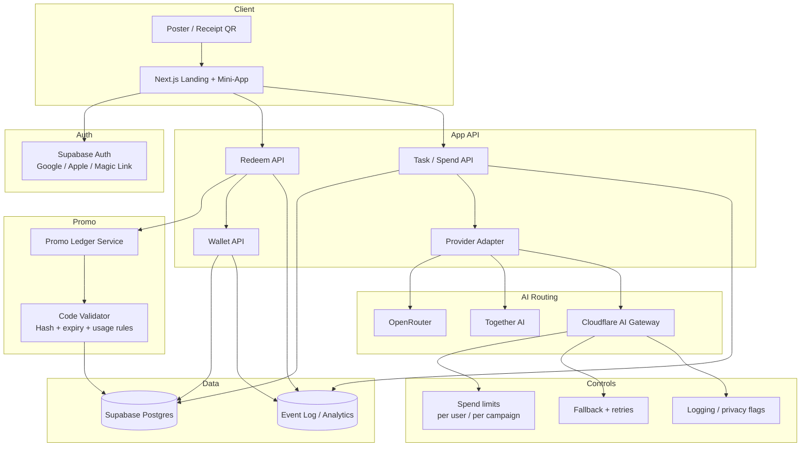
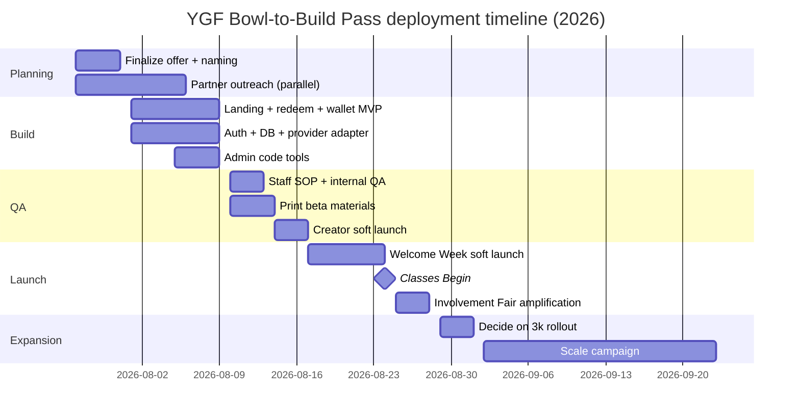

# YGF Bowl-to-Build Pass @ USC  
## Final, deployable campaign plan for Fall 2026 (analytical report)

## Executive summary

**Recommended public campaign name:**  
**YGF Bowl-to-Build Pass — for the USC community**  
(Do **not** present it as an official USC program unless you have explicit university approval. USC rules require student organizations and affiliated entities to make clear they are **not** official university departments or offices, and USC marks/logos are governed by university brand rules. citeturn19view11 citeturn10search11)

**Location fit:**  
This campaign is well matched to the YGF Malatang close to USC at **2526 S Figueroa St, Los Angeles**; the official restaurant site and official social handle describe it as the USC-area YGF location. citeturn0search3 citeturn0search7

**Best operating model:**  
- **Phase 1 (beta, 300 passes): self-run** using a YGF-owned mini-app, lightweight wallet, receipt-code redemption, and a very cheap text model.  
- **Phase 2 (3,000 passes): partner-backed** if metrics are strong—ideally with **OpenRouter** for routing / app attribution / optional OAuth and **Together AI** for sponsor credits / GTM support; **Cloudflare AI Gateway** is the strongest backend spend-control and logging layer if you want tighter ops control. OpenRouter supports OAuth PKCE, app attribution headers, and management API keys with limits; Cloudflare AI Gateway supports **per-user spend limits via `metadata.user_id`**, centralized logging, retries, caching, and model/provider fallback; Together AI publicly offers startup credits, engineering time, and GTM support. citeturn19view1 citeturn23view1 citeturn19view2 citeturn19view3 citeturn19view4 citeturn19view6 citeturn19view7

**Why this works:**  
You’re not “selling tokens.” You’re turning a **real-world purchase** into a **fast first-use AI experience**:
1. buy food,  
2. scan/claim,  
3. sign in,  
4. complete a useful AI task in under 90 seconds,  
5. optionally connect to a partner account to keep building.  

That is the same strategic pattern that made the JinGuYuan skill/news cycle interesting: a physical, everyday venue becomes an AI entry point, not just a poster with buzzwords. JinGuYuan’s public GitHub skill demonstrates the logic: structured queries, recommendations, queueing actions, and a real operational surface instead of a pure marketing slogan. citeturn16view0

**Hard recommendation:**  
- **Do not** force students to register on a third-party gateway on first touch.  
- **Do** keep the first redeem + first AI task inside the **YGF-owned flow**, then offer optional partner OAuth after the user gets value. OpenRouter’s OAuth PKCE flow is appropriate for this “connect later” step. citeturn19view1

**Launch window:**  
USC Welcome Week runs **August 17–23, 2026**; classes begin **August 24, 2026**; the Fall Involvement Fair is **August 25–27, 2026**; Trojan Welcome Experience continues through **September 27, 2026**. citeturn20view1 citeturn27view0 citeturn19view10

---

# 1) Objectives, positioning, and final offer design

## 1.1 Campaign objective
Create an **offline-to-AI acquisition funnel** that:
- increases YGF foot traffic and repeat visits,
- gives students a high-speed reason to try AI for **study, coding, career, and food-choice workflows**, and
- optionally converts some users into partner-connected AI users.

## 1.2 Public positioning
Use this message architecture:

- **Primary value prop:** “Buy a bowl. Build with AI.”
- **Secondary value prop:** “Study help, coding help, career help, and a smarter bowl pick.”
- **Tone:** practical, campus-native, not crypto/airdrop-y.

## 1.3 Avoid the word “token” in consumer copy
For USC-facing consumers, **“Build Credits”** or **“AI Credits”** will convert better and create less crypto confusion than “tokens.” Keep “token” internal, if at all.

## 1.4 Final offer
**Proposed public offer (beta):**
- Spend **$25+** in one transaction
- Receive **limited YGF Build Credits**
- Credits expire **14 days after redemption**
- No cash value; one account per person; eligible tasks only

**Important legal/comms note:**  
If the “$3” is only a marketing-style denominator inside your app and not a true provider-stored cash balance, say **“limited Build Credits”** instead of “$3 credit.” If you actually issue a true third-party account balance, then you can say “$3 partner credit” and must honor it exactly.

---

# 2) Prioritized existing public repos, assets, and examples to reuse or fork

Below, every repo/doc citation is a direct link.

## 2.1 Highest-priority repos to fork

| Priority | Repo / example | Why it matters | What to fork/adapt now |
|---|---|---|---|
| 1 | **Vercel Chatbot** — full-featured Next.js AI chatbot template citeturn16view1 | Best starting point for a fast, modern chat UX using Next.js App Router and AI SDK | Fork the chat UI, streaming patterns, route structure |
| 2 | **supabase-community/vercel-ai-chatbot** — Vercel chatbot adapted to Supabase Auth + Postgres citeturn16view2 | Closest to your need: auth, persisted chat, Next.js, Supabase, shadcn, Postgres | Fork auth/database wiring and chat persistence |
| 3 | **cloudflare/ai** — providers/examples for Workers AI and AI Gateway citeturn16view3 | Best source for AI Gateway integration patterns and Vercel AI SDK providers | Reuse provider adapters and Cloudflare-first inference wrappers |
| 4 | **loadchange/apex-ai-proxy** — Cloudflare Worker fronting LLMs via AI Gateway with routing, passthrough, model mapping citeturn26view0 | Excellent reference if you want a provider adapter / proxy layer with BYOK and AI Gateway | Fork proxy pattern, especially if you want a clean `/provider_call` service |
| 5 | **OpenRouterTeam/tool-calling** — OpenRouter Next.js demo with auth/KV/chat UI citeturn26view1 | Best reference if OpenRouter is your partner and you want tool-calling-ready UI patterns | Reuse OpenRouter headers, routing, Vercel KV/session patterns |
| 6 | **next.js with-supabase starter** — official Next.js + Supabase starter citeturn26view3 | Best minimal auth+SSR starter if you do not want a full chatbot template | Use for clean auth/setup if you build UI mostly yourself |
| 7 | **nextauthjs/next-auth-example** citeturn16view5 | Good fallback if you prefer Auth.js over Supabase Auth | Reuse Google / Apple / email auth flows |
| 8 | **vercel/nextjs-subscription-payments** citeturn16view4 | Good reference for wallet/billing/account screens and webhook-safe auth setup | Reuse account, billing, settings, and redirect patterns |
| 9 | **kozakdenys/qr-code-styling** citeturn16view6 | Best polished QR library for branded QR with logo styling | Use for poster and receipt/card QR generation |
| 10 | **soldair/node-qrcode** citeturn16view7 | Best if you need server-side/CLI QR generation (batch printing codes) | Generate printable QR assets in a script for posters/cards |
| 11 | **JinGuYuan/jinguyuan-dumpling-skill** citeturn16view0 | Strategic reference: turning a restaurant into an AI entrypoint with structured actions | Reuse its service/skill thinking, not its exact stack |
| 12 | **kristianfreeman/workers-vercel-ai-starter** citeturn26view2 | Simple example of a Vercel AI SDK frontend paired with Workers | Use if you want Cloudflare Workers for API and Vercel for frontend |

## 2.2 Design and UI assets (open-source / free-use)

| Asset | Use | Notes |
|---|---|---|
| **shadcn/ui** citeturn7search4 | Components for landing page and mini-app | Fastest way to ship credible UI |
| **Lucide** icons citeturn7search1 | Study / code / career / bowl icons | Large, consistent open-source icon set |
| **Heroicons** citeturn7search3 | Alternate icon system | Good for a cleaner editorial feel |
| **unDraw** illustrations + license citeturn7search2 citeturn7search6 | Optional illustration assets for web/social | Free commercial use without attribution |

## 2.3 Infrastructure/provider docs you’ll likely use directly

| Doc | Why |
|---|---|
| OpenRouter OAuth PKCE citeturn19view1 | Optional “connect partner account” step |
| OpenRouter Management API keys citeturn23view1 | Programmatic per-key limits and resets |
| OpenRouter app attribution headers citeturn19view2 citeturn23view5 | Co-branded app discoverability |
| Cloudflare AI Gateway overview citeturn19view4 | Logging, caching, fallback, analytics |
| Cloudflare AI Gateway spend limits citeturn19view3 | Per-user budget enforcement |
| Cloudflare AI Gateway REST API citeturn19view5 | Unified model calling |
| Cloudflare AI Gateway logging citeturn22view0 | Prompt/log storage controls |
| Cloudflare Unified Billing citeturn22view1 | Single-bill model with 5% fee |
| Together AI startup accelerator citeturn19view7 | Credits + support + GTM |
| Together serverless pricing/models citeturn28view0 citeturn28view2 | Cost model and low-friction serverless inference |
| USC Academic Calendar / Welcome Experience / Involvement Fair citeturn27view0 citeturn20view1 citeturn19view10 | Launch timing |
| USC RSO privileges & brand rules citeturn19view11 citeturn19view13 | Naming/comms constraints |
| USC data privacy policy + USC Privacy Notice citeturn19view12 citeturn31search0 | Notice language guidance |
| FTC influencer disclosures citeturn19view14 citeturn19view15 | Creator campaign compliance |

---

# 3) Recommended final stack

## 3.1 Default architecture recommendation
**Frontend:** Next.js App Router + shadcn/ui  
**Auth:** Supabase Auth (Google, Apple, magic link)  
**Database:** Supabase Postgres  
**Inference adapter:** custom provider adapter  
**Low-friction provider:** OpenRouter or Cloudflare AI Gateway  
**Partner option:** OpenRouter for app attribution / optional OAuth; Together for sponsor credits / GTM  
**Analytics:** PostHog or simple event table first; GA optional  
**Abuse protection:** code hashing + rate limiting + device fingerprint + optional Turnstile-like challenge if abuse emerges

## 3.2 Why this stack
- **Fastest path to production:** reuse Vercel Chatbot / Supabaseified Chatbot + shadcn + Supabase. citeturn16view1 citeturn16view2
- **Best spend control:** Cloudflare AI Gateway can budget per `metadata.user_id`, log costs/tokens, and fallback on error or budget exhaustion. citeturn19view3 citeturn19view4 citeturn19view6
- **Best co-marketing fit:** OpenRouter supports app attribution headers and OAuth PKCE connection flows. citeturn19view1 citeturn19view2
- **Best sponsor story:** Together publicly advertises credits, engineering support, and GTM support. citeturn19view7

---

# 4) Complete website sitemap

## 4.1 Public site + mini-app sitemap

| Path | Type | Purpose |
|---|---|---|
| `/` | Landing page | Explains the offer, shows QR/CTA, “how it works,” FAQs |
| `/offer` | Campaign explainer | Short-form variant for poster/social QR |
| `/redeem` | Claim page | Enter/scan receipt code, see eligibility, sign in |
| `/redeem/success` | Confirmation | Wallet initialized, route to first AI task |
| `/wallet` | Logged-in | Shows balance, expiry, available actions |
| `/task/study` | Mini-app | Study workflows |
| `/task/coding` | Mini-app | Coding workflows |
| `/task/career` | Mini-app | Career workflows |
| `/task/pick-my-bowl` | Mini-app | YGF-specific chooser |
| `/history` | Logged-in | Previous sessions and outputs |
| `/connect/openrouter` | Optional | OAuth connect to partner |
| `/expired` | State page | Credit or code expired |
| `/already-used` | State page | Code already redeemed |
| `/blocked` | State page | Fraud / abuse / throttling |
| `/faq` | Public | Rules, value, expiry, privacy |
| `/terms` | Public | Promotional terms |
| `/privacy` | Public | Privacy notice |
| `/creator-kit` | Optional | Creator rules, disclosure guidance |
| `/admin/codes` | Internal | Upload/print/revoke code batches |
| `/admin/dashboard` | Internal | Redemptions, activations, cost |
| `/staff` | Internal | Counter instructions, troubleshooting |

---

# 5) User flows

## 5.1 Primary flow: QR → redeem → wallet → first AI task → optional partner OAuth

```mermaid
flowchart LR
    A[Poster QR or Receipt QR] --> B[Landing /offer]
    B --> C{Have a qualifying receipt code?}
    C -- No --> D[Buy bowl at YGF<br/>Get receipt code]
    D --> E[Open /redeem]
    C -- Yes --> E[Open /redeem]
    E --> F[Enter or scan code]
    F --> G{Signed in?}
    G -- No --> H[Sign in with Google / Apple / magic link]
    G -- Yes --> I[Validate code + initialize wallet]
    H --> I
    I --> J[/redeem/success]
    J --> K[/wallet]
    K --> L{Choose first task}
    L --> M[Study]
    L --> N[Coding]
    L --> O[Career]
    L --> P[Pick My Bowl]
    M --> Q[Successful first result]
    N --> Q
    O --> Q
    P --> Q
    Q --> R{Continue?}
    R -- Yes --> S[Optional connect to OpenRouter via OAuth PKCE]
    R -- No --> T[Exit / return later]
```

## 5.2 Sharing-resistant redemption flow
**Recommendation:** receipt codes should be **single-use**, **hashed at rest**, and preferably either:
- printed automatically on receipt (best future state), or
- handed out as pre-generated scratch cards/stickers linked to a qualifying purchase (best beta state).

**Operational rule:** staff only hand the code after the receipt threshold is met.

## 5.3 Optional “soft campus” flow
Poster/social QR can go to `/offer` and say:
> “Eat at YGF. Get Build Credits. Complete your first AI task in under 90 seconds.”

This lets people learn before purchase without immediately hitting a redemption wall.

---

# 6) Wireframe-level page descriptions

## 6.1 `/` landing page (desktop/mobile)
**Goal:** explain the offer in <12 seconds.

**Layout:**
1. Sticky top bar  
   - left: YGF Bowl-to-Build logo lockup  
   - right: “Redeem” button, “FAQ”

2. Hero  
   - headline  
   - one-sentence explainer  
   - primary CTA: “Get Build Credits”  
   - secondary CTA: “How it works”  
   - hero image: top-down YGF bowl + phone showing wallet

3. “Use it for…” cards  
   - Study  
   - Coding  
   - Career  
   - Pick My Bowl  

4. “How it works” 3-step strip  
   - Buy bowl  
   - Claim code  
   - Use Build Credits

5. Social proof / campus copy  
   - “Built for a busy week: move-in, classes, projects, recruiting”

6. FAQ accordion  
   - Who’s eligible?  
   - Is this official USC?  
   - Do credits expire?  
   - Do I need a school email?

7. Footer  
   - terms / privacy / contact / creator disclosure note if needed

## 6.2 `/redeem`
**Goal:** lowest-friction code claim.

**Mobile-first structure:**
- Page title: “Claim your Build Credits”
- Input: `[ Enter receipt code ]`
- Button: `[ Continue ]`
- Inline helper: “Look for the 8-character code on your receipt/card”
- Sign-in drawer appears only after code format passes or user taps continue
- If signed in already, redeem immediately

**Behavioral note:**  
Do not ask for a full profile first. Ask only what’s needed to:
1. prevent fraud,  
2. restore access,  
3. deliver wallet access.

## 6.3 `/wallet`
**Goal:** convert redemption into action.

**Modules:**
- Balance card  
  - “Build Credits remaining”  
  - expiration date  
  - usage bar

- Quick start block  
  - “Finish your first AI task now”  
  - four big buttons

- “What you can do” section  
  - bullets/examples

- Optional partner CTA (shown only after one success)  
  - “Keep building with OpenRouter” or partner variant

## 6.4 `/task/*`
Every task page should follow the same shell:
- current balance / expiry
- preset examples
- text box / upload (optional for resume or code paste)
- “Generate”
- result card
- save/copy/share
- upsell to next workflow or partner

---

# 7) Two poster / flyer design concepts

## Design system notes
- Use **campus-adjacent** colors (deep red + warm gold + cream + charcoal), but **do not use USC shields, official wordmarks, or imply official school sponsorship** without permission. USC brand rules are explicit about controlled use of marks and about making affiliations clear. citeturn19view11 citeturn19view13
- Use **shadcn-style typography/UI** with Lucide or Heroicons for iconography. citeturn7search4 citeturn7search1 citeturn7search3
- Use a **top-down real bowl photo** from YGF-owned media (website/social) plus a branded QR generated with `qr-code-styling`. Official YGF USC social and official site can anchor the internal asset collection. citeturn0search3 citeturn0search7 citeturn16view6

---

## 7.1 Concept A — “Buy a bowl. Build with AI.”
**Mood:** practical, campus-credible, minimal, CTA-driven  
**Best for:** receipts, storefront, classroom-adjacent boards, social feed

### Layout
- large headline upper-left
- bowl photo right or lower-right
- QR block bottom-left
- four icon chips across middle:
  - Study
  - Coding
  - Career
  - Pick My Bowl

### Exact copy variant A1
**Headline:**  
**Buy a bowl. Build with AI.**

**Subhead:**  
Spend $25+ at YGF and unlock limited **Build Credits** for study help, coding help, career tasks, and smarter bowl picks.

**CTA block:**  
**Scan to claim**  
Get your code at checkout.

**Footer microcopy:**  
For the USC community. Not affiliated with or endorsed by USC.  
Credits are limited, non-transferable, and expire after redemption.

### Exact copy variant A2
**Headline:**  
**Your bowl comes with build mode.**

**Subhead:**  
Qualifying purchase → claim your YGF Build Credits → finish your first AI task in under 90 seconds.

**CTA:**  
**Eat. Scan. Ship.**

### Sizes
- Print poster: **24x36 in portrait**
- Mid poster: **11x17 in portrait**
- Counter placard: **5x7 in**
- Social feed: **1080x1350**
- Story: **1080x1920**
- Horizontal recap: **1200x628**

### Visual asset suggestions
- real bowl close-up
- phone wallet screen mockup
- branded QR with small bowl icon/logo
- background texture: subtle notebook grid or recipe-card lines

---

## 7.2 Concept B — “From broth to build mode.”
**Mood:** more playful, creator-friendly, more likely to spread on TikTok/IG Stories  
**Best for:** creator collaborations, Reels covers, late-night foot traffic

### Layout
- giant phrase in stacked text
- diagonal motion line from bowl → laptop
- sticky-note style labels:
  - resume fix
  - debug help
  - quiz me
  - bowl under $16

### Exact copy variant B1
**Headline:**  
**From broth to build mode.**

**Subhead:**  
Get limited YGF Build Credits with a qualifying bowl. Use them for school, side projects, recruiting, or your next YGF order.

**CTA:**  
**Scan. Claim. Cook less. Build more.**

### Exact copy variant B2
**Headline:**  
**Fuel your week. Then prompt it.**

**Subhead:**  
YGF + AI credits for the USC area.  
Study. Code. Recruit. Eat better.

**CTA:**  
**Get the pass**

### Sizes
Same as concept A, plus:
- Table tent: **4x6 in**
- Door vinyl: **18x24 in**

### Visual asset suggestions
- bowl photo + laptop flat lay
- screen snippets of short outputs
- campus-adjacent color bars
- optional unDraw-style illustration for social variants citeturn7search2

---

# 8) Landing page HTML/CSS/JS component spec

## 8.1 Structural spec

```html
<body>
  <header id="topbar">
    <div class="brand-lockup"></div>
    <nav>
      <a href="/faq">FAQ</a>
      <a href="/redeem" class="btn btn-primary">Redeem</a>
    </nav>
  </header>

  <main>
    <section id="hero">
      <div class="hero-copy">
        <p class="eyebrow">YGF Bowl-to-Build Pass</p>
        <h1>Buy a bowl. Build with AI.</h1>
        <p class="subhead">Qualifying purchase unlocks limited Build Credits for study help, coding help, career tasks, and smarter bowl picks.</p>
        <div class="cta-row">
          <a href="/redeem" class="btn btn-primary">Claim Build Credits</a>
          <a href="#how-it-works" class="btn btn-secondary">How it works</a>
        </div>
        <p class="microcopy">For the USC community. Not affiliated with or endorsed by USC.</p>
      </div>
      <div class="hero-visual">
        <!-- bowl image + phone wallet mock -->
      </div>
    </section>

    <section id="use-cases">
      <article class="card">Study</article>
      <article class="card">Coding</article>
      <article class="card">Career</article>
      <article class="card">Pick My Bowl</article>
    </section>

    <section id="how-it-works">
      <div class="step">1. Buy a bowl</div>
      <div class="step">2. Claim your code</div>
      <div class="step">3. Use Build Credits</div>
    </section>

    <section id="faq-preview"></section>
  </main>

  <footer></footer>
</body>
```

## 8.2 CSS / design token spec

| Token | Suggested value | Use |
|---|---|---|
| `--bg` | `#FFF8F1` | warm cream background |
| `--surface` | `#FFFFFF` | cards |
| `--text` | `#1F2937` | primary text |
| `--muted` | `#6B7280` | secondary text |
| `--primary` | `#8B1E2D` | deep red CTA |
| `--accent` | `#F2B84B` | gold accent |
| `--success` | `#0F766E` | redeem success |
| `--radius` | `18px` | cards/buttons |
| `--shadow` | `0 10px 30px rgba(0,0,0,.08)` | cards |
| `--maxw` | `1200px` | layout width |

**Typography recommendation:** Inter / Geist / system sans  
**Grid:** 12-col desktop, single-col mobile  
**Animation:** keep subtle; QR should be visually dominant on print, not neon

## 8.3 JS behavior
- sticky CTA after scroll past hero
- FAQ accordion
- QR deep-link UTM tagging
- source capture (`poster_a`, `counter_card`, `receipt_qr`, `creator_story`)
- simple page-event logging:
  - `LP_VIEW`
  - `CTA_REDEEM_CLICK`
  - `FAQ_OPEN`
  - `QR_SCAN_SOURCE_RESOLVED`

## 8.4 Example landing page copy
**Hero headline:**  
**Buy a bowl. Build with AI.**

**Subhead:**  
A qualifying YGF purchase unlocks limited Build Credits for study help, coding help, career tasks, and smarter bowl picks.

**How it works:**  
1. Order at YGF  
2. Get your code at checkout  
3. Claim and use your credits in minutes

**Examples:**  
- Turn lecture notes into flashcards  
- Fix a bug from your stack trace  
- Rewrite a resume bullet  
- Build a bowl under your budget

---

# 9) Mini-app UX for first-time users

## 9.1 Onboarding sequence (first-time user)

### Screen 1 — Welcome
**Title:** “Your Build Credits are ready”  
Copy: “Use them for study help, coding help, career tasks, or a smarter bowl pick.”

Buttons:
- Continue
- See terms

### Screen 2 — Sign-in
Offer:
- Continue with Google
- Continue with Apple
- Email magic link

**Recommendation:**  
Do **not** require a USC email. Use school email detection only for segmentation / optional campus bonus flows.

### Screen 3 — Redeem confirmation
Show:
- code accepted
- expiration countdown
- current balance
- “Start your first task”

### Screen 4 — Task picker
Big four buttons:
- Study
- Coding
- Career
- Pick My Bowl

### Screen 5 — First useful result
Aim for:
- useful output in <90 seconds
- obvious copy/share/save action
- return path to wallet

---

## 9.2 Anti-fraud design
Use layered controls, not one giant wall.

### Required controls
- code hashed at rest
- single-use promo code
- expiration timestamp
- one account can only redeem one Welcome Week intro code
- velocity limits on IP/device/email
- soft lock if too many failed attempts
- separate staff batch IDs for traceability
- log source + user agent + code prefix only (not full code plaintext)
- partner/provider spend cap per user

### Provider-level enforcement options
- **Cloudflare AI Gateway:** per-user spend limits via `metadata.user_id`; can block or fallback when a budget is exceeded. citeturn19view3
- **OpenRouter:** per-key limits and resets via Management API keys (`limit`, `limit_reset`). citeturn23view1

### UX principle
Do not punish everyone with heavy verification because a few users might share screenshots. Make the **first good path simple**, the suspicious path harder.

---

## 9.3 Sample prompts / workflows

## A) Study Help
**Preset cards**
- “Summarize my reading into 8 bullets”
- “Turn these notes into 15 flashcards”
- “Quiz me on this chapter”
- “Explain this concept like I’m cramming for a midterm”

**Prompt starter examples**
- “Summarize these lecture notes into a one-page study guide and 10 flashcards.”
- “I have an econ quiz tomorrow. Turn this chapter into practice questions with answers.”
- “Explain the difference between correlation and causation with one clean example.”

**Output framing**
- summary
- flashcards
- quiz mode
- save to notes

## B) Coding Help
**Preset cards**
- “Explain this error”
- “Refactor this function”
- “Write tests”
- “Compare two approaches”

**Prompt starter examples**
- “I’m getting this TypeScript error. Explain the root cause and suggest the smallest fix.”
- “Refactor this Python function for readability and include example tests.”
- “Explain this SQL query step by step and flag likely performance issues.”

**Guardrail**
Do not market it as guaranteed correct; say “review before submitting.”

## C) Career Help
**Preset cards**
- “Rewrite a resume bullet”
- “Draft a cold email”
- “Tailor my intro to a role”
- “Turn experience into STAR stories”

**Prompt starter examples**
- “Rewrite this resume bullet to sound sharper for a software engineering internship.”
- “Draft a concise LinkedIn message to a recruiter after a campus event.”
- “Turn these experiences into 3 behavioral interview STAR stories.”

## D) Pick My Bowl
This is the differentiator—make it fun *and* useful.

**Preset cards**
- “Build me a bowl under $16”
- “High-protein, less spicy”
- “Vegetarian, not bland”
- “Late-night comfort bowl”

**Prompt starter examples**
- “Build me a YGF bowl under $16 with high protein and mild spice.”
- “I don’t eat peanuts and I want something filling but not super oily.”
- “I’m sharing with one friend—suggest two contrasting bowls.”

**Important privacy note:**  
Avoid storing long-lived dietary/allergy histories unless you truly need them. If a user enters sensitive dietary info, display a lightweight note such as:  
> “Food suggestions are informational only. Please confirm ingredients/allergens with YGF staff.”

---

# 10) Backend architecture diagram



## Architecture notes
- **Promo ledger** is your business logic center—**not** the provider.
- **Provider adapter** chooses between OpenRouter / Together / Cloudflare based on mode:
  - beta simplest path: one cheap provider
  - scale path: Cloudflare AI Gateway or OpenRouter route/fallback
- **Logging** should separate:
  - campaign events (safe)
  - prompt payloads (optional, privacy-sensitive)
- Cloudflare can preserve metadata logging while turning off raw payload logging on specific requests using request headers. citeturn22view0

---

# 11) Database schema (recommended)

Below is a practical SQL-oriented schema.

## 11.1 Core tables

### `users`
```sql
id uuid primary key
email text unique
email_domain text
auth_provider text
created_at timestamptz
last_seen_at timestamptz
device_fingerprint text null
is_blocked boolean default false
```

### `promo_batches`
```sql
id uuid primary key
name text
source text -- welcome_week_2026, rso_night, creator_drop
issued_count int
expires_at timestamptz
created_at timestamptz
```

### `promo_codes`
```sql
id uuid primary key
batch_id uuid references promo_batches(id)
code_hash text unique
receipt_id text null
minimum_purchase_cents int default 2500
issued_at timestamptz
expires_at timestamptz
redeemed_by uuid null references users(id)
redeemed_at timestamptz null
redemption_source text null -- poster, receipt_qr, creator_story
status text check (status in ('issued','redeemed','expired','revoked'))
```

### `wallets`
```sql
id uuid primary key
user_id uuid unique references users(id)
currency text default 'build_credits'
initial_balance integer
remaining_balance integer
expires_at timestamptz
created_at timestamptz
updated_at timestamptz
```

### `ledger_entries`
```sql
id uuid primary key
wallet_id uuid references wallets(id)
entry_type text check (entry_type in ('redeem','spend','refund','adjustment'))
amount integer
usd_estimate numeric(10,4) null
provider text null
provider_model text null
request_id text null
metadata jsonb
created_at timestamptz
```

### `sessions`
```sql
id uuid primary key
user_id uuid references users(id)
task_type text check (task_type in ('study','coding','career','pick_my_bowl'))
status text check (status in ('started','completed','errored','blocked'))
input_token_estimate int null
output_token_estimate int null
provider text null
model text null
started_at timestamptz
completed_at timestamptz null
```

### `events`
```sql
id uuid primary key
user_id uuid null
event_name text
page text null
source text null
properties jsonb
created_at timestamptz
```

## 11.2 Admin / partner tables

### `partner_connections`
```sql
id uuid primary key
user_id uuid references users(id)
partner text -- openrouter
partner_account_id text null
oauth_status text check (oauth_status in ('connected','revoked','failed'))
connected_at timestamptz
```

### `provider_policies`
```sql
id uuid primary key
name text
default_provider text
fallback_provider text null
default_model text
fallback_model text null
max_usd_per_user numeric(10,2)
max_requests_per_hour int
payload_logging boolean default false
status text
```

---

# 12) API contract examples

## 12.1 `POST /api/redeem`
Redeems a promo code and initializes a wallet.

**Request**
```json
{
  "code": "BOWL7K2A",
  "source": "receipt_qr",
  "campaign": "welcome_week_2026"
}
```

**Response (success)**
```json
{
  "ok": true,
  "wallet": {
    "currency": "build_credits",
    "initial_balance": 3000,
    "remaining_balance": 3000,
    "expires_at": "2026-09-07T23:59:59-07:00"
  },
  "next": "/wallet"
}
```

**Response (already used)**
```json
{
  "ok": false,
  "error": "CODE_ALREADY_REDEEMED",
  "message": "This code has already been claimed."
}
```

---

## 12.2 `GET /api/get_balance`
**Response**
```json
{
  "ok": true,
  "wallet": {
    "remaining_balance": 2640,
    "currency": "build_credits",
    "expires_at": "2026-09-07T23:59:59-07:00"
  }
}
```

---

## 12.3 `POST /api/spend`
Deducts wallet balance after a model call (or pre-authorizes before call).

**Request**
```json
{
  "task_type": "coding",
  "estimated_cost_credits": 120,
  "provider_policy": "default_welcome_week_policy"
}
```

**Response**
```json
{
  "ok": true,
  "authorized": true,
  "remaining_balance": 2520
}
```

---

## 12.4 `POST /api/provider_call`
**Request**
```json
{
  "task_type": "study",
  "messages": [
    { "role": "system", "content": "You are a practical study assistant..." },
    { "role": "user", "content": "Turn these notes into 10 flashcards..." }
  ],
  "policy": "default_welcome_week_policy",
  "user_id": "u_123"
}
```

**Server-side behavior**
1. validate wallet > 0  
2. choose provider/model  
3. attach metadata:
   - `campaign=welcome_week_2026`
   - `task_type=study`
   - `metadata.user_id=u_123` (for Cloudflare spend limits) citeturn19view3
4. send request  
5. estimate or read usage  
6. write `ledger_entries` + `sessions`  
7. return result

**Response**
```json
{
  "ok": true,
  "provider": "cloudflare",
  "model": "@cf/qwen/qwen3-30b-a3b-fp8",
  "usage": {
    "input_tokens": 1420,
    "output_tokens": 480
  },
  "result": {
    "title": "Flashcards",
    "content": "1) ..."
  }
}
```

---

# 13) Partner pitch email template + negotiation asks

## 13.1 Email template (300-pass beta)

**Subject:** USC-area offline-to-AI pilot with YGF Bowl-to-Build Pass

**Body:**
> Hi [Partner Name],  
>   
> We’re preparing a Fall 2026 pilot called **YGF Bowl-to-Build Pass** for the USC community in Los Angeles. Students who make a qualifying purchase at the USC-area YGF Malatang location receive limited AI Build Credits through a lightweight YGF web app for **study help, coding help, career tasks, and food-choice workflows**.  
>   
> We are looking for a **non-exclusive infrastructure + growth partner** for a small controlled beta of **300 passes** during USC Welcome Week / early semester activity, with expansion to **3,000 passes** if metrics are strong.  
>   
> We would like to explore:
> - a capped inference credit pool for the pilot,
> - per-user spend controls,
> - usage reporting,
> - optional co-branding,
> - and a possible case study or social amplification if results are strong.  
>   
> We would retain the YGF-owned user entry flow and promo ledger, while making partner connection optional after users complete their first successful AI task.  
>   
> If useful, I can send a one-page funnel spec with projected redemption, activation, and partner attribution metrics.  
>   
> Best,  
> [Name]

## 13.2 Negotiation asks — 300-pass beta
Ask for:
- **$250–$500 capped inference pool**
- one onboarding session
- usage export or dashboard access
- no exclusivity
- co-brand permission
- technical contact for 2–4 weeks

## 13.3 Negotiation asks — 3,000-pass expansion
Ask for:
- **$750–$2,000 capped inference pool**
- **$1,000–$3,000 MDF / co-marketing support** if they want logos/posts/case study
- co-branded landing page or public mention
- partner attribution or OAuth connection path
- optional campus creator stipend support

## 13.4 Terms you should resist
- forced first-touch redirect to the partner’s site  
- exclusivity over all AI routing  
- broad rights to use student prompts in marketing  
- inability to set hard per-user budgets  
- “we own the user” language  
- partner takes all recovered emails without a clear privacy notice

---

# 14) Budget estimate and cost model

## 14.1 Source-based model pricing references
Representative public prices for lightweight text inference:

| Provider / model | Input / 1M | Output / 1M | Source |
|---|---:|---:|---|
| OpenRouter — **Qwen2.5 7B Instruct** | **$0.04** | **$0.10** | citeturn30view0 |
| OpenRouter — **MiniMax M3** | **$0.24** | **$0.96** | citeturn30view1 |
| Together — **Qwen2.5 7B Instruct Turbo** | **$0.30** | **$0.30** | citeturn28view1 |
| Together — **GPT-OSS 20B** | **$0.05** | **$0.20** | citeturn28view1 |
| Cloudflare Workers AI — **Qwen3-30B-A3B-FP8** | **$0.051** | **$0.335** | citeturn29view0 |

**Fee layer references:**
- OpenRouter pay-as-you-go platform fee: **5.5%** on credit purchases; inference prices are passed through with no markup. citeturn24view1 citeturn24view0
- Cloudflare Unified Billing fee: **5%** on credit purchases; provider pricing passed through with no markup. citeturn22view1
- Together serverless: no provisioning, no minimums, pay only for usage. citeturn28view0 citeturn28view2

## 14.2 Useful operational reality
If you constrain the experience to a lightweight text workflow, the **actual hard AI cost is usually far below the consumer-facing “credit” value**. That is why the economics can work.

### Modeling assumption for one activated user
Assume each activated user consumes:
- **60,000 input tokens**
- **18,000 output tokens**
over the lifetime of the promo window (multiple short tasks, some retries, some context)

### Estimated hard model cost per activated user

| Provider/model | Cost per activated user |
|---|---:|
| OpenRouter Qwen2.5 7B | `(60k * .04/M) + (18k * .10/M)` = **$0.0042** |
| Together GPT-OSS 20B | `(60k * .05/M) + (18k * .20/M)` = **$0.0066** |
| Cloudflare Qwen3-30B | `(60k * .051/M) + (18k * .335/M)` = **$0.0091** |

**Practical recommendation:** despite the low theoretical number, enforce a **hard per-user cap** of **$0.25** in beta and **$0.15–$0.25** in scale, because real-world prompts, uploads, retries, and abuse can expand usage. Cloudflare’s spend-limit model and OpenRouter per-key limit model are well-suited to this. citeturn19view3 citeturn23view1

## 14.3 Funnel assumptions

### 300-pass beta assumptions
- 300 passes distributed
- 22% redemption = **66 redeemers**
- 55% first-task activation = **36 activated users**
- 30% second-session rate = **20 return users**
- 10% optional partner OAuth = **7 partner-connected users**

### 3,000-pass expansion assumptions
- 3,000 passes distributed
- 28% redemption = **840 redeemers**
- 60% first-task activation = **504 activated users**
- 35% second-session rate = **294 return users**
- 12% optional partner OAuth = **101 partner-connected users**

## 14.4 Cash budget table (excluding founder/intern labor)

### A) 300-pass beta

| Cost line | Self-run | Partner-backed |
|---|---:|---:|
| Posters / flyers / counter cards | $120 | $120 |
| Receipt-code stickers / claim cards | $60 | $60 |
| Domain / hosting / email / misc SaaS | $40 | $40 |
| AI hard cost cap | $25 | $0–$10 |
| Creator meals / internal testing | $120 | $120 |
| Contingency | $100 | $80 |
| **Estimated total** | **$465** | **$420 or less** |

### B) 3,000-pass expansion

| Cost line | Self-run | Partner-backed |
|---|---:|---:|
| Posters / reprints / door signage | $300 | $300 |
| Code cards / stickers / table tents | $450 | $450 |
| Hosting / monitoring / analytics | $120 | $120 |
| AI hard cost cap | $150 | $0–$50 |
| Creator seeding / campus micro-events / staff meals | $900 | $600–$900 |
| Contingency | $300 | $250 |
| **Estimated total** | **$2,220** | **$1,720–$2,070** |

## 14.5 Cost/risk comparison: self-run vs partner-run

| Dimension | Self-run | Partner-run |
|---|---|---|
| Launch speed | **Fastest** | slower (approval cycles) |
| Data control | **Highest** | lower / negotiated |
| Provider lock-in | lowest | medium |
| PR / credibility | medium | **higher** |
| Hard AI cost | still low | possibly subsidized |
| Engineering complexity | medium | medium-high |
| Contract overhead | low | **higher** |
| Risk of partner redirect friction | none | **high if badly designed** |

**Recommendation:**  
- **Beta:** self-run or lightly partner-assisted  
- **Scale:** partner-backed if they fund credits, co-market, or want attributable OAuth connections

---

# 15) Deployment checklist and timeline for USC Welcome Week

## 15.1 Critical USC timing references
- Welcome Week: **Aug 17–23, 2026** citeturn20view1
- Move-in: **Aug 19, 2026** citeturn27view0
- Classes begin: **Aug 24, 2026** citeturn27view0
- Involvement Fair: **Aug 25–27, 2026** citeturn19view10 citeturn20view0
- Trojan Welcome Experience through **Sep 27, 2026** citeturn20view1

## 15.2 Deployment checklist

### Product
- [ ] Finalize public offer language
- [ ] Build landing page
- [ ] Build redeem flow
- [ ] Build wallet + 4 workflows
- [ ] Build admin code upload/revocation
- [ ] Set balance expiry logic
- [ ] Add analytics events

### Infra
- [ ] Configure auth providers
- [ ] Set environment variables
- [ ] Configure DB + migrations
- [ ] Implement provider adapter
- [ ] Add spend controls
- [ ] Add rate limits / fraud rules
- [ ] Add logs + privacy toggles

### Ops
- [ ] Print 300 beta code cards
- [ ] Train counter staff
- [ ] Build 1-page staff SOP
- [ ] Decide invalid-code recovery process
- [ ] Prepare reissue policy
- [ ] Prepare FAQ at checkout

### Growth
- [ ] 2 posters in-store
- [ ] 1 counter card at register
- [ ] 1 QR on receipt insert/sticker
- [ ] recruit 5–10 USC creators / org leads
- [ ] prepare disclosure language
- [ ] prepare IG story assets

### Legal/comms
- [ ] public disclaimer: “for the USC community,” not official USC program
- [ ] privacy page
- [ ] promo terms
- [ ] creator disclosure guidance
- [ ] partner terms if OAuth appears

## 15.3 Recommended timeline



---

# 16) Legal, privacy, and policy risks + recommended consent language

## 16.1 Key legal/policy risks

### A) USC naming/brand confusion
Risk: implying official USC sponsorship or using USC marks improperly.  
USC requires affiliated orgs/entities using its name/logos to follow brand rules and make clear they are not official departments or offices. citeturn19view11 citeturn19view13

**Recommendation:**  
Use:
> “YGF Bowl-to-Build Pass — for the USC community”

Do **not** use:
> “Official USC AI Credits Program”

### B) Personal information collection
USC’s privacy policy requires notice when USC collects personal information electronically, and USC’s general Privacy Notice explains collection/use/disclosure principles. citeturn19view12 citeturn31search0

**Recommendation:** even if the site is not USC-hosted, your privacy page should be similarly explicit:
- what you collect
- why
- with whom you share it
- how long you retain it
- how users contact you

### C) Prompt privacy / logging
Cloudflare AI Gateway logs by default, including prompts/responses, but offers controls to disable payload logging while still recording metadata. citeturn22view0

**Recommendation:**  
Default to:
- keep **event logs**
- keep **cost/tokens**
- disable or minimize long-term **prompt payload** storage until needed

### D) Creator/influencer disclosures
FTC guidance is explicit that endorsers should disclose material relationships, including free meals and other free items. citeturn19view14 citeturn19view15

**Recommendation:**  
Require creators to include:
- “ad”
- “sponsored”
- or clear language such as “YGF invited me / gave me a free meal / gave me promo credits”

### E) Misleading “dollar credits”
If the user is not actually receiving a true transferable $3 stored-value balance, **do not advertise it as cash-equivalent money**. Use “Build Credits” and state that they:
- have no cash value
- are limited to eligible services
- expire

### F) Sensitive data
Students may paste resumes, grades, course notes, or sensitive information.
**Recommendation:**  
Tell them **not** to enter:
- SSNs
- financial account info
- protected health info
- confidential USC records
- anything they would not want retained by a service provider

### G) No-sweepstakes confusion
Because the reward is tied to a qualifying purchase and distributed uniformly, this is **not** a sweepstakes if everyone who qualifies gets the same reward. Avoid “win,” “lottery,” or random drawings unless you implement formal promotion rules.

---

## 16.2 Recommended consent language (short form)

### Checkout / poster fine print
> Limited-time YGF promotional Build Credits. Qualifying purchase required. One redemption per person/account. Non-transferable. No cash value. Expires 14 days after redemption. Eligible AI tasks only. Terms and privacy apply.

### Redeem page consent
> By redeeming, you agree that YGF may process your email/account identifier, redemption activity, and prompts you submit to provide this promotional AI service. AI outputs may be inaccurate—review before relying on them. Do not submit SSNs, payment card numbers, medical data, or confidential school information. If you connect a partner account, the partner’s terms and privacy notice also apply.

### USC disclaimer
> This promotion is offered by YGF for the USC community and is not sponsored, endorsed by, or administered by the University of Southern California.

### Creator disclosure guidance
> If you received a free meal, promo credits, or any other benefit from YGF, clearly disclose that relationship in your post.

---

# 17) Final recommendation on partner strategy

## 17.1 Should you partner with a gateway?
**Yes — but not as the first-touch user experience.**

### Best split of responsibilities
- **YGF owns**
  - landing page
  - redemption
  - wallet
  - first task UX
  - campaign analytics
  - promo ledger
- **Partner owns**
  - inference routing
  - optional credits
  - optional OAuth connection
  - co-marketing / case study

## 17.2 Best partner map
- **OpenRouter:** best for app attribution, optional user connection, broad routing, public app story. OpenRouter supports app attribution headers and OAuth PKCE, and offers management API keys with per-key limits and resets. citeturn19view2 citeturn19view1 citeturn23view1
- **Cloudflare AI Gateway:** best for backend governability—logging, retries, provider fallback, and per-user spend limits. citeturn19view4 citeturn19view3 citeturn19view6
- **Together AI:** best sponsor story—credits + engineering time + GTM for AI-native growth experiments. citeturn19view7

**Final call:**  
- beta: **self-run with one provider**
- expansion: **partner-backed, but YGF-controlled frontend**

---

# 18) Internship-style deliverable plan + supervisor sign-off items

If you want this to read as a true internship-style outcome, structure it as a supervised project with explicit deliverables.

## 18.1 Suggested role title
**AI Product & Growth Intern**  
or  
**Product Engineering / Growth Intern (YGF Bowl-to-Build Pass)**

## 18.2 Deliverables package
| Deliverable | What counts as done | Supervisor sign-off |
|---|---|---|
| Product brief / PRD | final offer, funnel, metrics, risks | signed PDF or comment |
| Design pack | posters, landing page, wireframes, brand notes | approval on final assets |
| Technical implementation | repo, deployed site, DB schema, provider adapter | link + acceptance |
| Redemption ops pack | staff SOP, code batch workflow, FAQ | manager approval |
| Analytics dashboard | redemption, activation, partner conversion, cost | screenshot + review |
| Partner outreach pack | email template, target list, negotiation terms | approval or edits |
| Launch retrospective | what worked, what failed, next steps | final meeting note |

## 18.3 Suggested internship-proof artifacts
Ask the supervisor to provide:
1. **written scope / offer email**
2. **start date / end date**
3. **weekly or biweekly check-in cadence**
4. **named supervisor**
5. **learning objectives**  
   - product design  
   - growth funnel execution  
   - AI integration  
   - analytics / experimentation
6. **end-of-term evaluation**
7. **completion letter on letterhead** stating
   - title
   - dates
   - hours/week
   - responsibilities
   - deliverables completed
   - supervisor signature

## 18.4 Sample sign-off language
> [Name] served as an AI Product & Growth Intern for YGF from [date] to [date]. During this period, [Name] designed and implemented the Bowl-to-Build Pass campaign, including campaign strategy, web and poster assets, redemption flow, analytics instrumentation, AI provider integration, and launch operations. [Name] reported to [Supervisor Name] and completed the approved deliverables listed in the attached project summary.

---

# 19) Final prioritized to-do list

## Must do this week
1. Finalize public name and disclaimers  
2. Choose stack: **Supabase + Next.js + one provider**  
3. Fork **supabase-community/vercel-ai-chatbot** or **Vercel Chatbot** and strip it down to the campaign flows citeturn16view2 citeturn16view1  
4. Build `/`, `/redeem`, `/wallet`, and one task page  
5. Generate 300 one-time codes  
6. Design Poster Concept A and 5x7 counter card  
7. Write terms + privacy + creator disclosure guidance  
8. Train staff with a 1-page SOP  
9. Soft test with 10–20 users  
10. Launch during **Aug 17–24, 2026**

## Should do next
11. Add Cloudflare or OpenRouter spend controls  
12. Add optional partner OAuth only after first completed task  
13. Add analytics dashboard  
14. Send partner pitch with beta screenshots + expected attribution model  
15. Prepare 3,000-pass print batch only after early metrics look healthy

---

# Bottom line

**Most deployable final plan:**  
- **Brand it:** “YGF Bowl-to-Build Pass — for the USC community”  
- **Build it:** YGF-owned landing page + redeem flow + wallet + 4 fast workflows  
- **Run beta:** self-run, 300 single-use passes, Welcome Week launch  
- **Scale it:** partner-backed after you can show redemption, activation, and return-use numbers  
- **Present it as work:** with a named supervisor, documented deliverables, and final sign-off, this is strong internship-style product/growth evidence

If you want, I can turn this into **three ready-to-use assets next**:
1. a **one-page PRD**,  
2. a **Figma-style page-by-page wireframe spec**, and  
3. **final production poster copy blocks** you can paste straight into Canva/Figma.
